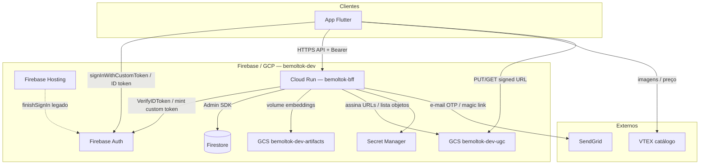

# BemolTok — estrutura Firebase / GCP

Projeto: **`bemoltok-dev`** (número `119999976463`).

O app mobile fala com **Firebase Auth** e com o **BFF no Cloud Run**. O BFF é o único que lê/escreve **Firestore** (regras em lockdown). Storage de mídia UGC e embeddings ficam em **buckets GCS**, não no Firebase Storage SDK do app.

---

## Modelo mental

| O que as pessoas chamam | O que é de verdade |
|---|---|
| “Firebase do BemolTok” | Projeto GCP `bemoltok-dev` com Auth + Firestore + Hosting |
| “O back na nuvem” | **Cloud Run** (`bemoltok-bff`), não uma VM |
| “Banco” | **Firestore** (via Admin SDK no BFF) |
| “Arquivos / mídia” | **Cloud Storage** (artifacts + UGC) |

---

## Diagrama (Mermaid)



---

## Produtos em uso

| Produto | Papel na app | Quem acessa |
|---|---|---|
| **Firebase Auth** | Sessão após OTP (custom token → ID token) | App (SDK) + BFF (Admin) |
| **Cloud Firestore** | `users`, `events`, `product_stats`, `experiments`, `auth_codes`, `posts` | **Só BFF** (Admin SDK). Cliente: deny all |
| **Firebase Hosting** | `finishSignIn.html` / páginas do magic link legado | Browser (`bemoltok-dev.firebaseapp.com`) |
| **Cloud Run** | BFF Go `bemoltok-bff` (API HTTP) | App → HTTPS público |
| **Cloud Storage** | Embeddings + mídia UGC | BFF monta artifacts; app faz PUT/GET signed no UGC |
| **Secret Manager** | SendGrid, X-App-Key, admin, HMAC | Injetado no Cloud Run |
| **Cloud Build / Artifact Registry** | Build/deploy da imagem do BFF | Ops / `gcloud deploy` |

---

## Firestore — coleções

Regras (`firestore.rules`):

```
allow read, write: if false;
```

Todo acesso passa pelo Cloud Run com Admin SDK.

| Coleção | Doc ID | Campos principais | Usado por |
|---|---|---|---|
| `users` | `{uid}` | `uid`, `email`, `bemolClientId`, `clientIdVerified`, `createdAt`, `lastSeenAt` | `GET/POST /me` |
| `auth_codes` | `{HMAC(email)}` | HMAC do código OTP (não o código em claro), TTL ~10 min | `POST /auth/request-code`, `/verify-code` |
| `events` | `{eventId\|hash}` | `uid`, `product_id`, `kind`, `value`, `rank`, `propensity`, experiment… | `POST /events` |
| `product_stats` | `{product_id}` | Contadores agregados (UCB1 / trends) | Atualizado por eventos; lido por recommend/trends |
| `experiments` | `{experiment_id}` | Config A/B ativa + variantes | `GET /experiments` |
| `posts` | `{post_id}` | `uid`, `product_id`, `type`, `media[]`, `status`, `created_at`… | `POST/GET /posts`, `/complete` |

---

## Buckets GCS

| Bucket | Conteúdo |
|---|---|
| `bemoltok-dev-artifacts` | ~2.1 GB de embeddings / `meta.json`. Montado no Cloud Run (leitura). Alimenta `/recommend` e `/similar`. |
| `bemoltok-dev-ugc` | Bucket privado. Objetos `posts/{uid}/{postId}/…`. App sobe via signed PUT; lê via signed GET (~60 min). |

Outros buckets de ops (build): `bemoltok-dev_cloudbuild`, `run-sources-bemoltok-dev-southamerica-east1`.

---

## Apps registrados (Firebase)

| Plataforma | Identificador | SDK no app |
|---|---|---|
| Android | `1:119999976463:android:c356f6800b6a72a45fff7a` | `firebase_core` + `firebase_auth` |
| iOS | bundle `com.davidcamurca.bemoltok` | `firebase_core` + `firebase_auth` |

O `firebase_options.dart` cita `storageBucket: bemoltok-dev.firebasestorage.app`, mas o app **não** usa o Firebase Storage SDK — UGC vai pelo GCS com signed URLs do BFF.

---

## Fluxo de login (OTP)

1. App → BFF `POST /auth/request-code` (+ header `X-App-Key`)
2. BFF grava HMAC em `auth_codes` + envia e-mail via SendGrid
3. App → BFF `POST /auth/verify-code`
4. BFF mint Firebase **custom token** (Admin SDK)
5. App `signInWithCustomToken` → sessão Firebase Auth
6. Rotas protegidas: `Authorization: Bearer <ID token>`
7. BFF `VerifyIDToken` + domínio permitido `@bemol.com.br`

---

## Serviço Cloud Run (BFF)

| Item | Valor |
|---|---|
| Serviço | `bemoltok-bff` |
| Região | `southamerica-east1` |
| URL | `https://bemoltok-bff-bium6anima-rj.a.run.app` |
| Recursos típicos | 4 vCPU / 8 GiB (embeddings em memória) |
| Scaling | `min-instances` configurável (`0` = sob demanda; `1` = always-on / mais caro) |

### Rotas HTTP do BFF

| Rota | Auth |
|---|---|
| `GET /health` | Público |
| `POST /auth/request-code`, `/auth/verify-code` | Público + `X-App-Key` |
| `POST /auth/send-link` | Público + `X-App-Key` (legado) |
| `GET /me`, `POST /me/client-id` | Bearer |
| `GET /recommend` | Bearer |
| `GET /similar/{id}` | Público |
| `GET /trends` | Público |
| `GET /experiments` | Bearer |
| `POST /events`, `POST /clickout` | Bearer |
| `POST /posts`, `POST /posts/{id}/complete`, `GET /posts` | Bearer |
| `POST /admin/reload` | `X-Admin-Token` |

---

## O que este projeto **não** usa

- Firestore SDK no app (cliente)
- Realtime Database
- FCM / push
- Cloud Functions (no código atual)
- Cloud SQL / Postgres
- Compute Engine (VM)
- Firebase Storage SDK no app

---

## Pastas relevantes no repo

```
bemoltok-backend/
├── .firebaserc          # default → bemoltok-dev
├── firebase.json        # Hosting + Firestore rules
├── firestore.rules      # lockdown
├── public/              # Hosting (finishSignIn, etc.)
└── api/server/          # BFF Go (Auth, Firestore, GCS, rotas)

bemoltok-front/
├── lib/firebase_options.dart
├── android/.../google-services.json
├── ios/Runner/GoogleService-Info.plist
└── lib/features/auth/   # OTP + FirebaseAuth
```

---

## Fontes

- `bemoltok-backend`: `firebase.json`, `firestore.rules`, `api/server/*.go`, `api/README.md`
- `bemoltok-front`: `firebase_options.dart`, `features/auth/*`
- GCP Console / `gcloud` no projeto `bemoltok-dev`
