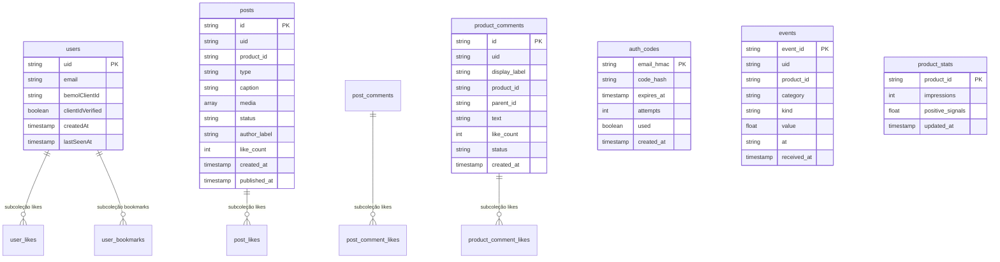

# Modelagem de Banco de Dados, Coleções e Storage

Este documento descreve a infraestrutura de dados do ecossistema **BemolTok**, cobrindo o banco de dados na nuvem (**Cloud Firestore**), o armazenamento de objetos (**Google Cloud Storage**), as regras de segurança e o armazenamento local no dispositivo móvel (**SQLite e SharedPreferences**).

---

## 1. Cloud Firestore (Servidor / Nuvem)

### 1.1. Política de Segurança e Acesso (Lockdown)

No projeto `bemoltok-dev`, o Firestore opera sob **lockdown total de acesso direto** do lado do cliente (mobile e web).
As regras configuradas em `firestore.rules` definem:

```javascript
rules_version = '2';
service cloud.firestore {
  match /databases/{database}/documents {
    match /{document=**} {
      allow read, write: if false;
    }
  }
}
```

#### Princípio Arquitetural
- **Nenhum cliente móvel se conecta diretamente ao Firestore** utilizando as chaves públicas do Firebase SDK.
- **100% das operações de leitura e escrita são mediadas pelo BFF no Cloud Run** através do `Firebase Admin SDK` (em Go).
- Essa decisão garante:
  1. Proteção de dados sensíveis (PII como e-mail de colaboradores e `bemolClientId` não vazam para a internet).
  2. Integridade dos contadores de telemetria, exploração UCB1 e reputação social (impede injeção de likes falsos ou manipulação de contadores).
  3. Validação centralizada de regras de negócio antes de qualquer persistência.

---

### 1.2. Mapeamento das Coleções e Subcoleções



---

### 1.3. Detalhamento dos Documentos e Schemas

#### Coleção: `users`
Armazena a identidade do usuário e os vínculos corporativos com a Bemol.
- **Caminho**: `/users/{uid}`
- **ID do Documento**: Firebase Auth `UID`.
- **Campos**:
  | Campo | Tipo | Descrição |
  |---|---|---|
  | `uid` | `string` | Identificador único gerado pelo Firebase Auth. |
  | `email` | `string` | E-mail corporativo (`@bemol.com.br`). |
  | `bemolClientId` | `string` | Código do cliente (`ID_CLIENTE`) associado no catálogo/recomendador. |
  | `clientIdVerified` | `boolean` | `true` se vinculado via diretório corporativo validado; `false` se auto-declarado. |
  | `createdAt` | `timestamp` | Data/hora UTC do primeiro login. |
  | `lastSeenAt` | `timestamp` | Data/hora UTC da última requisição ao BFF. |

##### Subcoleções de `users/{uid}`:
1. `/users/{uid}/likes/{productId}`:
   - Registra o like do usuário em um produto.
   - Campos: `product_id` (string), `updated_at` (timestamp).
2. `/users/{uid}/bookmarks/{productId}`:
   - Registra o produto favoritado pelo usuário.
   - Campos: `product_id` (string), `updated_at` (timestamp).

---

#### Coleção: `auth_codes`
Armazena os códigos OTP de 6 dígitos enviados por e-mail para autenticação passwordless.
- **Caminho**: `/auth_codes/{emailHMAC}`
- **ID do Documento**: `HMAC-SHA256(secret, lower(email))` (o e-mail em texto puro nunca é a chave do documento).
- **Campos**:
  | Campo | Tipo | Descrição |
  |---|---|---|
  | `code_hash` | `string` | `HMAC-SHA256(secret, "otp:" + email + ":" + code)`. O código em claro nunca é armazenado. |
  | `expires_at` | `timestamp` | Data de expiração (TTL de 10 minutos após geração). |
  | `attempts` | `int` | Contador de tentativas incorretas. Bloqueado com `>= 5`. |
  | `used` | `boolean` | Flag de consumo do código (impede reutilização/replay attacks). |
  | `created_at` | `timestamp` | Data de emissão. |

---

#### Coleção: `posts`
Armazena as publicações de reviews em formato de vídeo ou álbum de fotos criadas pelos colaboradores.
- **Caminho**: `/posts/{postId}`
- **ID do Documento**: UUID v4 gerado na chamada de inicialização.
- **Campos**:
  | Campo | Tipo | Descrição |
  |---|---|---|
  | `id` | `string` | UUID idêntico à chave do documento. |
  | `uid` | `string` | UID do autor da postagem. |
  | `product_id` | `string` | Referência do produto avaliado (`RefId` ou `ProductId`). |
  | `type` | `string` | `"video"` ou `"photos"`. |
  | `caption` | `string` | Legenda do post (máx 500 caracteres UTF-8). |
  | `media` | `array<map>` | Lista de objetos: `[{"object": "posts/...", "content_type": "...", "size": 12345}]`. |
  | `status` | `string` | `"awaiting_upload"` (iniciado) ou `"published"` (concluído). |
  | `author_label` | `string` | Nome público do autor (ex: prefixo do e-mail). |
  | `like_count` | `int` | Total de curtidas no post (incrementado/decrementado atomicamente). |
  | `created_at` | `timestamp` | Data/hora de início da criação. |
  | `published_at` | `timestamp` | Data/hora de conclusão e publicação no feed. |
  | `reported_count` | `int` | Contagem de denúncias para moderação (reservado). |
  | `moderation_reason` | `string` | Motivo de reprovação se moderado. |
  | `moderated_at` | `timestamp` | Data da ação de moderação. |
  | `moderated_by` | `string` | Identificador do moderador ou sistema. |

##### Subcoleção de `posts/{postId}`:
- `/posts/{postId}/likes/{uid}`:
  - Registro de quem curtiu o post. Impede que o mesmo usuário dê like mais de uma vez.
  - Campos: `uid` (string), `created_at` (timestamp).

---

#### Coleção: `product_comments`
Árvore hierárquica de comentários e dúvidas sobre produtos do catálogo Bemol.
- **Caminho**: `/product_comments/{commentId}`
- **ID do Documento**: UUID v4.
- **Campos**:
  | Campo | Tipo | Descrição |
  |---|---|---|
  | `id` | `string` | UUID do comentário. |
  | `uid` | `string` | UID do autor. |
  | `display_label` | `string` | Nome exibido do autor. |
  | `product_id` | `string` | Código do produto associado. |
  | `parent_id` | `string` | ID do comentário pai (se for resposta encadeada) ou string vazia para raiz. |
  | `text` | `string` | Conteúdo da mensagem (máx 2000 caracteres). |
  | `like_count` | `int` | Contador atômico de curtidas. |
  | `status` | `string` | `"published"`, `"hidden"`, `"pending_review"`, `"rejected"`. |
  | `created_at` | `timestamp` | Data de postagem. |

##### Subcoleção de `product_comments/{commentId}`:
- `/product_comments/{commentId}/likes/{uid}`:
  - Controle de curtidas por usuário no comentário.
  - Campos: `uid` (string), `created_at` (timestamp).

---

#### Coleção: `post_comments`
Comentários e interações voltadas exclusivamente para postagens UGC de colaboradores.
- **Caminho**: `/post_comments/{commentId}`
- **ID do Documento**: UUID v4.
- **Campos e Subcoleções**: Mesma estrutura de `product_comments`, substituindo `product_id` por `post_id`.

---

#### Coleção: `events`
Log imutável de telemetria e interações em tempo real enviadas pelos aplicativos.
- **Caminho**: `/events/{eventId}`
- **ID do Documento**: UUID v4 fornecido pelo app ou hash determinístico `SHA-256(uid|product_id|kind|at)` para garantir **idempotência de rede**.
- **Campos**:
  | Campo | Tipo | Descrição |
  |---|---|---|
  | `uid` | `string` | Identificador do usuário. |
  | `product_id` | `string` | Produto interagido. |
  | `category` | `string` | Categoria do produto. |
  | `kind` | `string` | Tipo de evento (`view`, `like`, `bookmark`, `share`, `click_out`, `comment`). |
  | `value` | `float` | Peso numérico do evento (ex: 1.0). |
  | `at` | `string` | Timestamp ISO8601 da ocorrência no cliente. |
  | `rank` | `int` | Posição ordinal que o item ocupava no carrossel de exibição. |
  | `propensity` | `float` | Propensão $P(\text{item} \mid \text{política})$ logada para avaliação offline IPW. |
  | `injection_source` | `string` | Origem da exibição (`feed`, `similar`, `explore`). |
  | `experiment_id` | `string` | ID do experimento A/B ativo na sessão. |
  | `variant` | `string` | Variante atribuída ao usuário no teste A/B. |
  | `session_id` | `string` | ID de sessão de navegação contínua no app. |
  | `impression_id` | `string` | ID único da impressão na tela. |
  | `weights_version` | `string` | Versão dos pesos do recomendador/reranker. |
  | `client_version` | `string` | Versão do aplicativo móvel (`1.0.0`). |
  | `received_at` | `timestamp` | Data/hora do servidor ao processar o evento (`serverTimestamp`). |

---

#### Coleção: `product_stats`
Acumuladores estatísticos que alimentam o algoritmo de exploração UCB1 e o ranking de tendências (`/trends`).
- **Caminho**: `/product_stats/{productId}`
- **ID do Documento**: Código do produto (`productId`).
- **Campos**:
  | Campo | Tipo | Descrição |
  |---|---|---|
  | `impressions` | `int` | Total de vezes que o produto foi visualizado na tela (`kind = "view"`). |
  | `positive_signals` | `float` | Soma acumulada dos eventos positivos (`like`, `bookmark`, `share`, `click_out`, `comment`). |
  | `updated_at` | `timestamp` | Data da última atualização atômica. |

---

#### Coleção: `experiments`
Configuração de experimentos de A/B testing gerenciados pelo backend.
- **Caminho**: `/experiments/{experiment_id}`
- **ID do Documento**: Identificador do teste (ex: `exp_feed_gap_v1`).
- **Campos**:
  | Campo | Tipo | Descrição |
  |---|---|---|
  | `active` | `boolean` | Se o experimento está ativo e distribuindo tráfego. |
  | `variants` | `array<map>` | Lista de variantes contendo `variant`, `bucket_from`, `bucket_to` e `params`. |

---

## 2. Google Cloud Storage (GCS)

O projeto utiliza dois buckets principais dedicados a fins distintos:

### 2.1. Bucket de UGC: `bemoltok-dev-ugc`
Bucket privado para fotos e vídeos enviados pelos usuários.
- **Acesso**: Nenhuma leitura ou escrita é pública.
- **Segurança**:
  - Upload realizado através de **URLs V4 Assinadas (`PUT`)** emitidas pelo BFF (`uploadURLTTL = 15m`).
  - Visualização realizada através de **URLs V4 Assinadas (`GET`)** emitidas pelo BFF (`viewURLTTL = 60m`).
  - O Service Account do Cloud Run utiliza o método `iamcredentials.SignBlob` para assinar as URLs com `roles/iam.serviceAccountTokenCreator`.
- **Estrutura de Nomes de Objetos**:
  ```text
  posts/{uid}/{postId}/{index}.{ext}
  ```
  - Exemplo: `posts/U12345/b3f2e1a0-9c8d-4e5f-b1a2-3c4d5e6f7a8b/0.mp4`
- **Validação de Limites**:
  - Imagens: máx 10 MiB por arquivo (`image/jpeg`, `image/png`).
  - Vídeos: máx 100 MiB por arquivo (`video/mp4`, `video/quicktime`).

---

### 2.2. Bucket de Artefatos ML: `bemoltok-dev-artifacts`
Armazena a matriz de recomendação treinada offline pelo pipeline de dados (exportada via script Python).
- **Tamanho Total**: Aproximadamente `2.1 GB`.
- **Modo de Uso**: Montado como volume ou lido na inicialização do Cloud Run no caminho `/data/artifacts`.
- **Arquivos**:
  | Arquivo | Formato | Descrição |
  |---|---|---|
  | `meta.json` | JSON | Metadados gerais: `{dims: 64, n_clients: 158200, n_products: 4210, hybrid_alpha: 0.7}`. |
  | `client_ids.json` | JSON | Mapeamento ordenado de strings de `ID_CLIENTE` para o offset no arquivo binário. |
  | `product_meta.json` | JSON | Dicionário `{product_id: {name, category, price}}`. |
  | `client_embeddings.bin` | Binário | Vetores de float32 contíguos dos usuários (`n_clients × dims × 4 bytes`). |
  | `item_embeddings.bin` | Binário | Vetores de float32 contíguos dos produtos (`n_products × dims × 4 bytes`). |
  | `product_popularity.bin` | Binário | Vetores float32 normalizados de popularidade histórica das vendas. |
  | `directory.csv` | Texto (HMAC) | Mapeamento `HMAC-SHA256(email);ID_CLIENTE` para auto-link seguro. |

---

## 3. Armazenamento Local no Mobile (Dispositivo)

Para manter fluidez visual e funcionamento offline resiliente, o aplicativo Flutter utiliza armazenamento local estruturado.

### 3.1. SQLite (`interactions.db` via `sqflite`)

Gerenciado pela classe `InteractionStorage`, armazena os eventos de telemetria antes de serem sincronizados com a nuvem via `POST /events`.

#### Tabela: `interactions`
- **Versão Atual do Banco**: `v6`
- **Índices Criados**:
  - `idx_interactions_at ON interactions(at)`
  - `idx_interactions_synced ON interactions(synced)`

#### Estrutura de Colunas:
| Coluna | Tipo SQLite | Descrição |
|---|---|---|
| `id` | `INTEGER PRIMARY KEY AUTOINCREMENT` | Chave primária local. |
| `event_id` | `TEXT` | UUID v4 gerado no app para garantir idempotência. |
| `product_id` | `TEXT NOT NULL` | SKU ou ID do produto. |
| `category` | `TEXT NOT NULL` | Categoria do produto. |
| `kind` | `TEXT NOT NULL` | Tipo do evento (`view`, `like`, `bookmark`, etc.). |
| `value` | `REAL NOT NULL` | Peso do evento (padrão 1.0). |
| `at` | `INTEGER NOT NULL` | Timestamp em milissegundos da ocorrência. |
| `name` | `TEXT` | Nome do produto exibido no momento. |
| `price` | `REAL` | Preço do produto no instante da interação. |
| `description` | `TEXT` | Descrição breve. |
| `rank` | `INTEGER` | Posição no carrossel de visualização. |
| `experiment_id` | `TEXT` | Teste A/B ativo. |
| `variant` | `TEXT` | Variante atribuída ao usuário. |
| `injection_source` | `TEXT` | Origem da injeção do item (ex: `similar_items`). |
| `propensity` | `REAL` | Probabilidade da política para avaliação IPW. |
| `session_id` | `TEXT` | Identificador único da sessão de uso. |
| `impression_id` | `TEXT` | Identificador de impressão em tela. |
| `weights_version` | `TEXT` | Versão dos coeficientes do recomendador. |
| `synced` | `INTEGER NOT NULL DEFAULT 0` | Flag: `0 = pendente de envio`, `1 = enviado com sucesso ao BFF`. |

#### Políticas de Retenção e Expurgos Automáticos:
1. **Limite Temporal**: Eventos já sincronizados com mais de **90 dias** são automaticamente expurgados do SQLite para liberar espaço em disco.
2. **Capacidade Máxima**: O volume local é limitado a **5.000 eventos** mais recentes.

---

### 3.2. SharedPreferences (Chaves Simples)

Utilizado para persistência de preferências rápidas e flags de estado no dispositivo:

| Chave | Tipo | Finalidade |
|---|---|---|
| `bemoltok.last_client_id` | `String` | Guarda o último `ID_CLIENTE` utilizado para agilizar inicialização offline. |
| `bemoltok.recently_seen_products` | `List<String>` | Lista dos últimos 20 produtos visualizados para alimentar histórico e carrossel de recomendação local. |
| `bemoltok.sqlite.migrated.v1` | `bool` | Flag indicando se a migração legada de eventos de SharedPreferences para SQLite foi concluída. |
