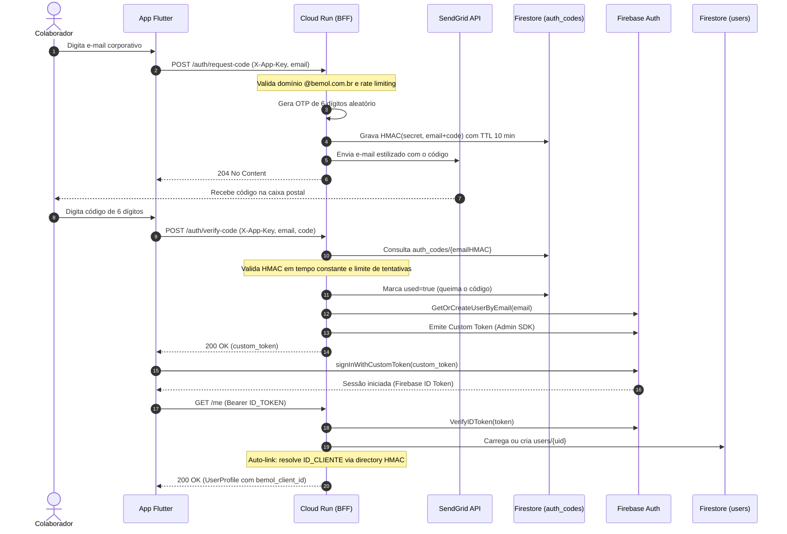
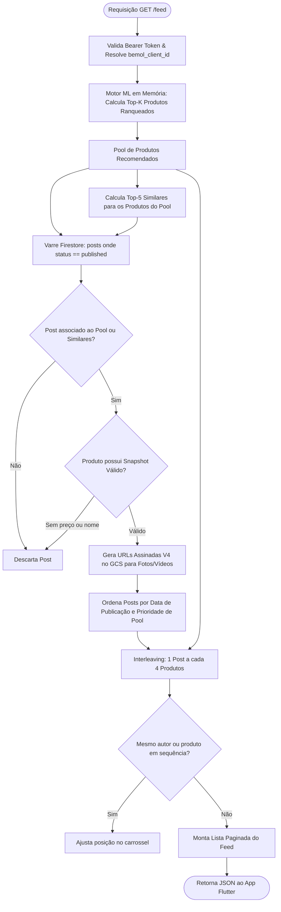
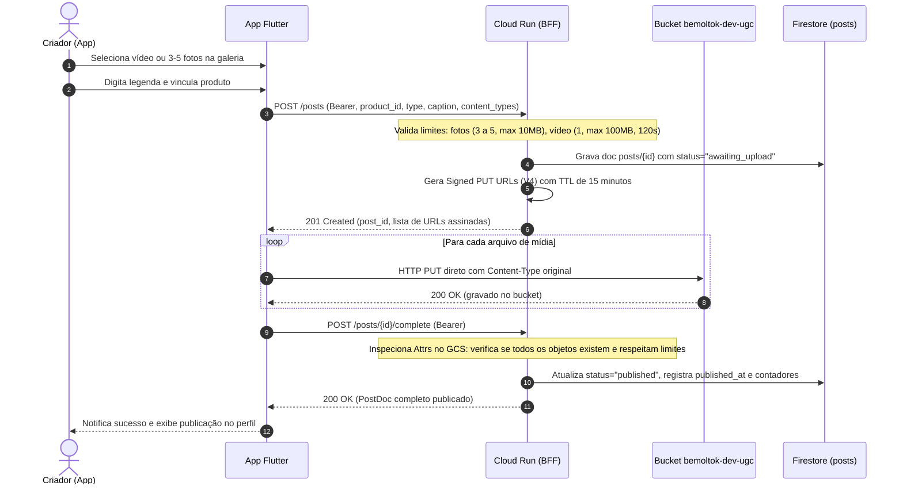

# Fluxos de Negócio, Arquitetura e Funcionamento do Sistema

Este documento descreve detalhadamente o funcionamento interno, algoritmos matemáticos e fluxos operacionais de ponta a ponta do **BemolTok**.

---

## 1. Fluxo de Autenticação Passwordless via OTP

O BemolTok adota autenticação sem senha (passwordless) restrita ao domínio corporativo `@bemol.com.br`, garantindo conformidade com a política de acesso interno e sem exigir gerenciamento de senhas pelos colaboradores.



### Auto-renovação de Token no Frontend (`sendAuthed`)
Todas as chamadas autenticadas do Flutter utilizam a função utilitária `sendAuthed` localizada em [auth_http.dart](file:///Users/nelsonpinto/dev/BemolTok/bemoltok-front/lib/core/auth_http.dart).
- Se uma requisição retornar código `401 Unauthorized` (por expiração do token de 1 hora do Firebase), o cliente invoca `currentUser.getIdToken(forceRefresh: true)` automaticamente e reexecuta a requisição sem interromper a navegação do usuário.

---

## 2. Geração e Composição do Feed Misto (`GET /feed`)

O feed do BemolTok não exibe apenas produtos estáticos de vitrine, mas cria uma experiência de mídia contínua intercalando produtos de alta relevância com vídeos e fotos de reviews gerados por colaboradores (UGC).



### Regras do Interleaving do Feed:
1. **Razão de Proporção**: 1 post UGC para cada 4 produtos recomendados (`feedDefaultPostGap = 4`).
2. **Desduplicação de Autor**: Evita que dois vídeos ou fotos do mesmo criador apareçam colados na sequência do feed.
3. **Desduplicação de Produto**: Evita que o mesmo SKU seja exibido repetidas vezes consecutivas.
4. **Resiliência Visual**: Se um produto ou post não tiver imagem válida ou preço no catálogo, ele é descartado pelo filtro `productSnapshotUsable` para que o usuário nunca veja cards quebrados.

---

## 3. Ciclo de Vida de Upload UGC (Two-Step Upload Seguro)

Para que vídeos pesados (até 100 MiB) e fotos de alta resolução não sobrecarreguem as instâncias do Cloud Run e consumam banda desnecessária no backend, o BemolTok adota a estratégia de **upload direto no storage via URLs assinadas**:



---

## 4. Algoritmo de Recomendação e Exploração UCB1

O motor de recomendação combina aprendizado supervisionado de matrizes esparsas com aprendizado por reforço para equilibrar itens consolidados e novos produtos em catálogo (**Exploitation vs. Exploration**).

### 4.1. Fórmula do Score de Ranqueamento

Para um cliente $u$ e um produto candidato $i$, o score final é computado por:

$$\text{Score}(u, i) = \alpha \cdot \langle \mathbf{e}_u, \mathbf{e}_i \rangle + (1 - \alpha) \cdot \text{Pop}_i + \gamma \cdot \text{UCB1}_i$$

Onde:
- $\mathbf{e}_u, \mathbf{e}_i \in \mathbb{R}^{64}$: Vetores latentes de embedding do cliente e do item, pré-computados via decomposição matricial (ALS) e normalizados.
- $\langle \mathbf{e}_u, \mathbf{e}_i \rangle$: Produto escalar vetorial computado em memória com operações SIMD desenroladas de 8 em 8 dimensões.
- $\text{Pop}_i \in [0, 1]$: Popularidade histórica normalizada das vendas do produto.
- $\alpha = 0.7$: Parâmetro de peso híbrido configurado em `meta.json`.
- $\gamma = 0.2$: Peso da exploração ativa de novidades (`ucbGamma = float32(0.2)`).

### 4.2. Bônus de Exploração UCB1 (Upper Confidence Bound)

$$\text{UCB1}_i = \begin{cases} 
1.0, & \text{se } N_i = 0 \text{ (item totalmente novo / cold start)} \\
\bar{X}_i + c \cdot \sqrt{\frac{\ln(T + 1)}{N_i}}, & \text{se } 0 < N_i < 50 \\
0.0, & \text{se } N_i \ge 50 \text{ (item quente / warm threshold)}
\end{cases}$$

Onde:
- $N_i$: Total de impressões do produto $i$ acumuladas em `product_stats`.
- $\bar{X}_i = \frac{\text{Sinais Positivos}_i}{N_i}$: Taxa média de conversão e engajamento.
- $T = \sum_{j} N_j$: Total geral de impressões de todo o catálogo.
- $c = 0.5$: Constante de exploração UCB1 (`ucbC = 0.5`).
- Limite de aquecimento: Produtos com 50 ou mais impressões deixam de receber bônus de exploração e passam a concorrer puramente por relevância e vendas reais.

### 4.3. Loop Contínuo de Telemetria e Atualização
1. O aplicativo dispara lotes de visualizações e cliques para `POST /events`.
2. O BFF executa incrementos atômicos no Firestore na coleção `product_stats`.
3. A cada 5 minutos (`statsRefreshRate = 5 * time.Minute`), uma goroutine em segundo plano no Cloud Run lê `product_stats` e recalcula em lote todo o vetor `ucbScores` em memória RAM, sem gerar travamento de requisições.

---

## 5. Proxy do Catálogo VTEX e Enriquecimento de Preços

Como os IDs de produto originados pelo pipeline de Machine Learning misturam `RefId` (código de referência do fornecedor) e `ProductId` interno da VTEX, e a API privada de SKU não devolve ofertas comerciais (`CommertialOffer`), o BFF implementa um resolvedor resiliente:

```mermaid
flowchart TD
    Req([GET /catalog/sku/{refId}]) --> PrivateSKU[Consulta VTEX Private SKU: stockkeepingunitbyalternateId]
    PrivateSKU --> CheckComplete{Possui Imagem, Detalhe e Preço?}
    CheckComplete -- Sim --> ReturnDirect[Retorna Payload da VTEX]
    CheckComplete -- Não --> PublicSearch1[Busca Pública VTEX: fq = alternateIds_RefId:{refId}]
    PublicSearch1 --> CheckHit1{Encontrou Produto?}
    CheckHit1 -- Não --> PublicSearch2[Busca Pública VTEX: fq = productId:{refId}]
    CheckHit1 -- Sim --> Synth[synthesizeSKUFromSearch: extrai imagens, link da loja e sellers]
    PublicSearch2 --> CheckHit2{Encontrou Produto?}
    CheckHit2 -- Sim --> Synth
    CheckHit2 -- Não --> ReturnFallback[Retorna dados disponíveis ou 404]
    Synth --> Merge[mergeSKUVisuals: Funde SKU original com preços e fotos da busca]
    Merge --> ReturnDirect
```

### Vantagens do Proxy Centralizado:
- **Segurança Absoluta**: As credenciais corporativas da VTEX (`VTEX_APP_KEY` e `VTEX_APP_TOKEN`) residem exclusivamente no GCP Secret Manager e nas variáveis do Cloud Run. O aplicativo Android/iOS não conhece as chaves.
- **Cache de Imagens em Memória**: O BFF mantém cache interno em memória (`imageCache map[string]string`) com trava de leitura/escrita (`sync.RWMutex`), evitando requisições duplicadas de fotos para a VTEX.
- **Normalização de Imagens**: Converte automaticamente URLs relativas (`//bemol...` ou `/arquivos/...`) em URLs HTTPS canônicas (`https://bemol.vteximg.com.br/...`).

---

## 6. Sistema de Comentários Hierárquicos e Moderação Social

O sistema de comentários permite tanto perguntas diretas na ficha técnica dos produtos quanto conversas sociais nos vídeos dos colaboradores:

### 6.1. Proteção Anti-Injeção e Integridade
O método `decodeCreateCommentRequest` rejeita qualquer requisição em que o cliente tente forjar os seguintes campos protegidos:
- `uid`, `email`, `author_label` (identidade controlada pelo token).
- `status`, `like_count`, `reported_count`, `moderation_reason`, `moderated_at`, `moderated_by` (propriedades administrativas do servidor).

### 6.2. Estrutura em Árvore (Threads / Respostas)
- Comentários raiz possuem `parent_id = ""` (string vazia).
- Respostas a dúvidas contêm o `parent_id` apontando para o comentário original.
- A validação no backend garante que o `parent_id` exista e pertença rigorosamente ao mesmo `product_id` ou `post_id`.
- A listagem recupera os documentos ativos e ordena cronologicamente por `created_at`.
