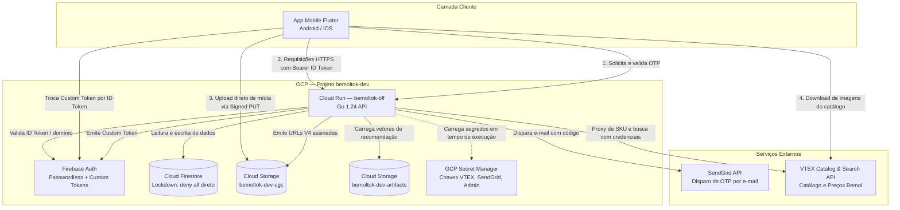

# BemolTok — Documentação Técnica do Ecossistema

Bem-vindo à documentação técnica oficial da plataforma **BemolTok**. Esta pasta reúne o mapeamento exaustivo da arquitetura, rotas de API, modelos de banco de dados, fluxos de negócio e manuais operacionais.

---

## 1. Índice dos Documentos

| Documento | Assunto Principal | Conteúdo |
|---|---|---|
| **[01_ROTAS_API.md](file:///Users/nelsonpinto/dev/BemolTok/docs/01_ROTAS_API.md)** | **Endpoints e Protocolos HTTP** | Especificação de todas as rotas do BFF (Go), métodos HTTP, cabeçalhos de segurança, parâmetros de query, esquemas de payload JSON, códigos de retorno e erros. |
| **[02_BANCO_DE_DADOS_E_STORAGE.md](file:///Users/nelsonpinto/dev/BemolTok/docs/02_BANCO_DE_DADOS_E_STORAGE.md)** | **Estrutura de Dados e Storage** | Schemas de documentos do Firestore (`users`, `posts`, `comments`, `events`, `product_stats`, etc.), política de lockdown, estrutura de buckets do Google Cloud Storage e banco SQLite do app móvel. |
| **[03_FLUXOS_E_FUNCIONAMENTO.md](file:///Users/nelsonpinto/dev/BemolTok/docs/03_FLUXOS_E_FUNCIONAMENTO.md)** | **Arquitetura e Fluxos de Negócio** | Diagramas de sequência Mermaid e funcionamento: autenticação passwordless OTP, feed misto (produtos + reviews), upload seguro de mídia UGC, algoritmo híbrido UCB1 e proxy VTEX. |
| **[04_GUIA_DE_OPERACAO_E_DEPLOY.md](file:///Users/nelsonpinto/dev/BemolTok/docs/04_GUIA_DE_OPERACAO_E_DEPLOY.md)** | **Deploy, Configuração e Operação** | Lista de variáveis de ambiente, segredos do Secret Manager, comandos oficiais para deploy no Cloud Run e compilação/instalação do app Flutter no celular físico. |

---

## 2. Visão Geral da Arquitetura

O **BemolTok** opera sob uma arquitetura desacoplada e segura centrada em um **BFF (Backend for Frontend)** rodando no Google Cloud Run, garantindo que credenciais sensíveis nunca transitem no aplicativo móvel:

---

## 3. Resumo das Tecnologias

- **Frontend**: Flutter 3.x / Dart (arquitetura reativa com Riverpod, persistência local com SQLite `sqflite`, reprodutor de vídeo nativo, suporte a layout adaptativo).
- **Backend (BFF)**: Go (alta performance com dot-product SIMD/desenrolado de 8 em 8 dimensões para álgebra linear de embeddings, concorrência nativa com goroutines).
- **Banco de Dados na Nuvem**: Google Cloud Firestore (noSQL documental gerenciado pelo Admin SDK no Cloud Run).
- **Armazenamento de Objetos**: Google Cloud Storage (GCS) com geração de Signed URLs V4 (PUT e GET) usando Service Account IAM token signing.
- **Motor de Recomendação**: Híbrido baseado em decomposição de matrizes esparsas (ALS), popularidade de vendas e exploração ativa com bandit multi-armed **UCB1** (Upper Confidence Bound).
- **Catálogo de E-commerce**: VTEX Commerce APIs com agregação e síntese resiliente de ofertas comerciais (`CommertialOffer`).
